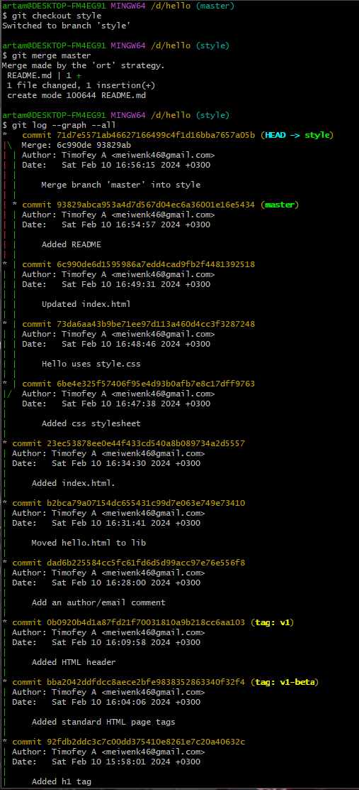

---
## Front matter
title: "Отчёт по лабораторной работе №1"
subtitle: "Работа с Git и Markdown"
author: "Артамонов Тимофей Евгеньевич"
---
# Цель работы

* Вспомнить как работать с системой Git
* Вспомнить как работать с языком Markdown

# Задание 

1. Создать репозиторий Git
2. Выполнить все указанные команды
3. Выполнить отчет в Markdown

# Выполнение лабораторной работы

Создали репозиторий, создали файл hello.html и вспомнили как работает индексирование и сохранение изменений. (рис. 1)

{рис. 1}

Вспомнили как можно просмотреть историю коммитов. (рис. 2)

{рис. 2}

Вспомнили как можно перемещаться между версиями. (рис. 3)

{рис. 3}

Дали теги двум версиям, чтобы не потерять их. (рис. 4)

{рис. 4}

Удалили нежелательный коммит. (рис. 5)

{рис. 5}

Просмотрели историю коммитов(даже удаленных). (рис. 6)

{рис. 6}

Вместо создания нового коммита и удаления старого, просто переименовали старый. (рис. 7)

{рис. 7}

При открытии файла index открывается сайт с окошком Hello, World! (рис. 8)

{рис. 8}

Просмотрели файлы конфигурации репозитория. (рис. 9)

{рис.9}

Создали новую ветку style. (рис. 10)

{рис. 10}

Видно что в разных ветках один и тот же файл отличается. (рис. 11)

{рис. 11}

Видно графическое представление того, что происходит в репозиторие. (рис. 12)

{рис. 12}

Графическое представление конфликта, который мы создали. (рис. 13)

{рис. 13}

Результат работы команды rebase. (рис. 14)

{рис. 14}

Склонировали наш репозиторий (рис. 15)

{рис. 15}

Сделали pull и получили данные из оригинального репозитория в клонированном. (рис. 16)

{рис. 16}

# Выводы

Вспомнили как работать с системой Git, пока выполняли все действия из лабораторной работы. Вспомнили как работать с языком Markdown, пока писали этот отчет.

# Список литературы

- Мой мозг
- Мой разум
- Моё сознание
- Лабораторные работы по OS
- [Inspiration](https://youtu.be/7OYFay9Bel4)
